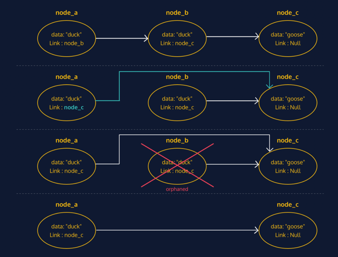

# Linked List
## What is a linked list?
Linked lists are one of the basic data structures used in computer science. They have many direct applications and serve as the foundation for more complex data structures.

The list is comprised of a series of nodes as shown in the diagram above. The head node is the node at the beginning of the list. Each node contains data and a link (or pointer) to the next node in the list. The list is terminated when a node’s link is null. This last node is called the tail node.

Consider a one-way air travel itinerary. The trip could involve traveling through several airports (nodes) connected by air travel segments (links). In this example, the initial departure city is the head node and the final arrival city is the tail node.

Since the nodes use links to denote the next node in the sequence, the nodes are not required to be sequentially located in memory. These links also allow for quick insertion and removal of nodes as you will see in future exercises.

Common operations on a linked list may include:
* adding nodes 
* removing nodes 
* finding a node 
* traversing (or traveling through) the linked list
As an example, we added values to the linked list diagram from above:

This linked list contains three nodes (node_a, node_b, and node_c).

Each node in this particular list contains a string as its data. As the sequence is defined, the order is "cats", "dogs", and "birds".

The list ends at node_c since the link within that node is set to null.

## Adding to and Removing from the Linked List
With linked lists, because nodes are linked to from only one other node, you can’t just go adding and removing nodes willy-nilly without doing a bit of maintenance.
### Adding a New Node
Adding a new node to the beginning of the list requires you to link your new node to the current head node. This way, you maintain your connection with the following nodes in the list.
### Removing a Node
If you accidentally remove the single link to a node, that node’s data and any following nodes could be lost to your application, leaving you with orphaned nodes.

To properly maintain the list when removing a node from the middle of a linked list, you need to be sure to adjust the link on the previous node so that it points to the following node.

Depending on the language, nodes that are not referenced are removed automatically. “Removing” a node is equivalent to removing all references to the node.

Look at the diagram below to see the proper manner of removing a node:

In order to remove node_b, you must first link node_a to node_c (where node_b was linking). Then you can remove node_b.

## Review
Let’s take a minute to review what we’ve covered about linked lists in this lesson.

Linked Lists:

* Are comprised of nodes
* The nodes contain a link to the next node (and also the previous node for bidirectional linked lists)
* Can be unidirectional or bidirectional
* Are a basic data structure, and form the basis for many other data structures
* Have a single head node, which serves as the first node in the list
* Require some maintenance in order to add or remove nodes
* The methods we used are an example and depend on the exact use case and/or programming language being used
