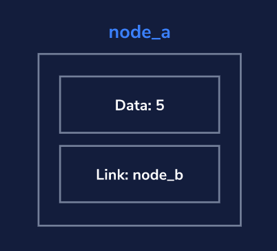

# Node
## What is a Node?
Nodes are the fundamental building blocks of many computer science data structures. They form the basis for linked lists, stacks, queues, trees, and more. In this article, we’ll discuss what a node is as well as how nodes link to other nodes.

An individual node contains data and links to other nodes. Each data structure adds additional constraints or behavior to these features to create the desired structure.

Consider the node depicted below. This node (node_a) contains a piece of data (the number 5) and a link to another node (node_b):

## Node Implementations
The data contained within a node can be a variety of types, depending on the language you are using. In the previous example, it was an integer (the number 5), but it could be a string ("five"), decimal (5.1), an array ([5,3,4]) or nothing (null).

The link or links within the node are sometimes referred to as pointers. This is because they “point” to another node.

Typically, data structures implement nodes with one or more links. If these links are null, it denotes that you have reached the end of the particular node or link path you were previously following.

A variety of node implementations are depicted in the following diagram. Examine the types of data and how some of the nodes are linked:

## Node Linking
Often, due to the data structure, nodes may only be linked to a single other node. This makes it very important to consider how you implement modifying or removing nodes from a data structure.

If you inadvertently remove the single link to a node, that node’s data and any linked nodes could be “lost” to your application. When this happens to a node, it is called an orphaned node.

Examine the nodes in the diagram:

node_c is only linked to node_b. If you would like to remove node_b but not node_c, you can’t simply delete the link from node_a to node_b.

The most straightforward method to preserve node_c would be to change the link in node_a to point to node_c instead of node_b. However, some data structures may handle this in a different manner.
## Recap
Let’s take a minute to review what we’ve covered about nodes in this article.

Nodes:

* Contain data, which can be a variety of data types
* Contain links to other nodes. If a node has no links, or they are all null, you have reached the end of the path you were following.
* Can be orphaned if there are no existing links to them
